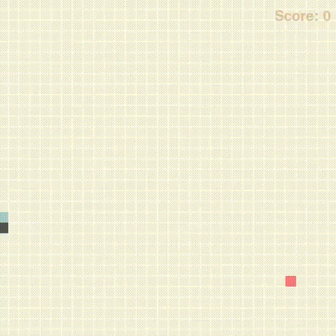

# AI playing Snake
A basic reinforcement learning agent capable of playing Snake, using tabular and deep Q-learning algorithms.

 
&emsp;&emsp;

Agent at episode 1 and after 300 episodes of training

