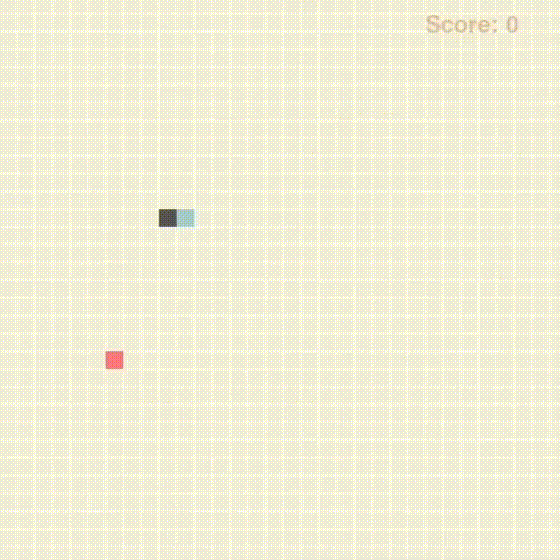
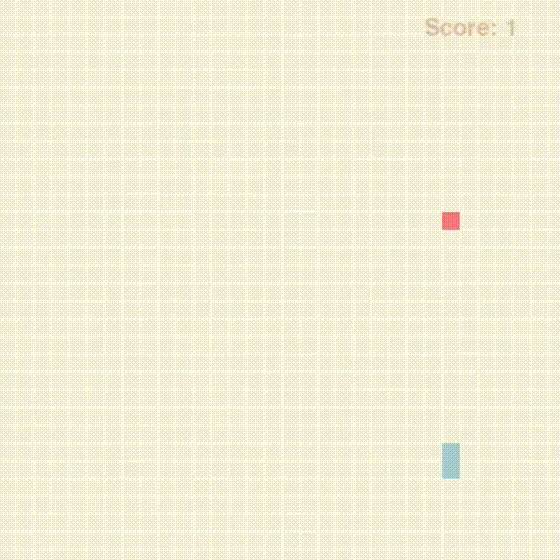

# AI playing Snake
A basic reinforcement learning agent capable of playing Snake, using tabular and deep Q-learning algorithms.
<div align="center" >

&emsp;&emsp;

</div>


<p align = "center">
Before and after training
</p>

## Requirements
```
pygame
pytorch
numpy
pickle
```
## Usage
`game.py` is a playable version of the game.<br>
`train.py` is the main script for training, it is possible to specify the agent and training parameters. For example:
```
python train.py --agent QAgent --episodes 500 --lr 0.01 --epsilon 1.0 --render 1 --render_every 1
```
`test.py` allows to see the trained agent playing for a certain number of episodes. For example:
```
python test.py --agent QAgent --Q_table PATH_TO_Q_TABLE --episodes 10
```